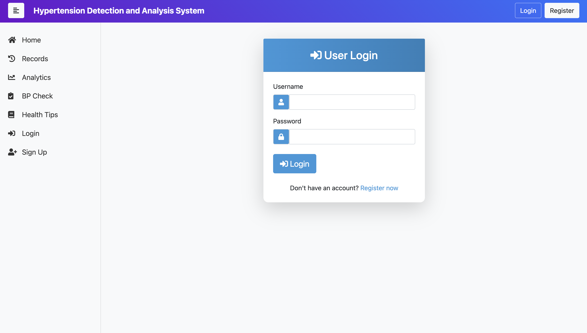
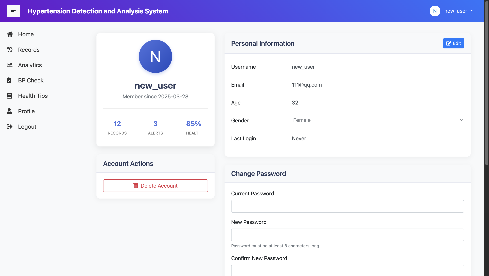
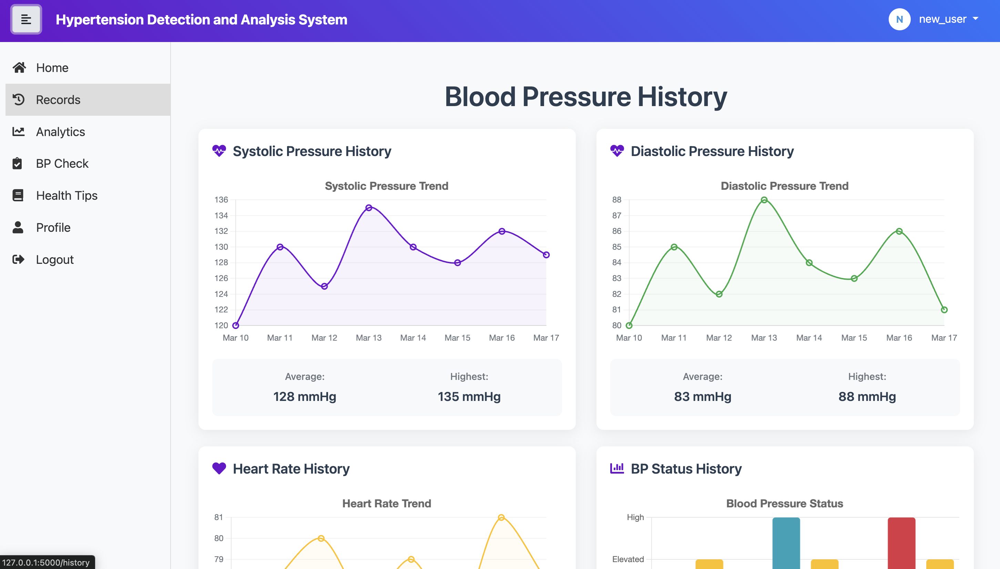
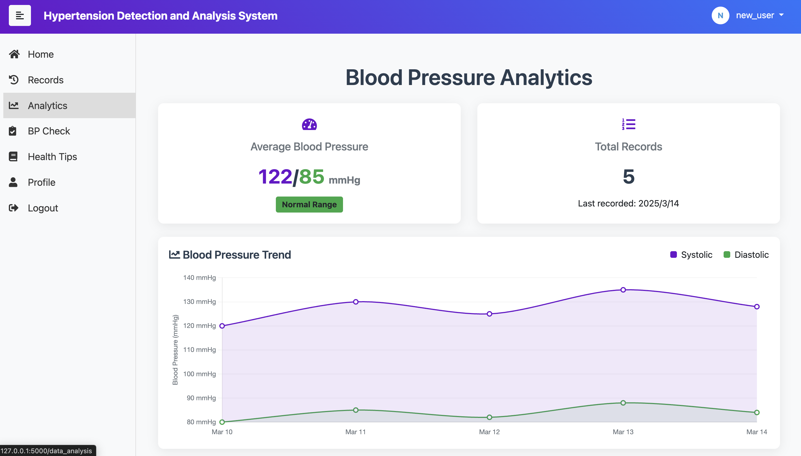
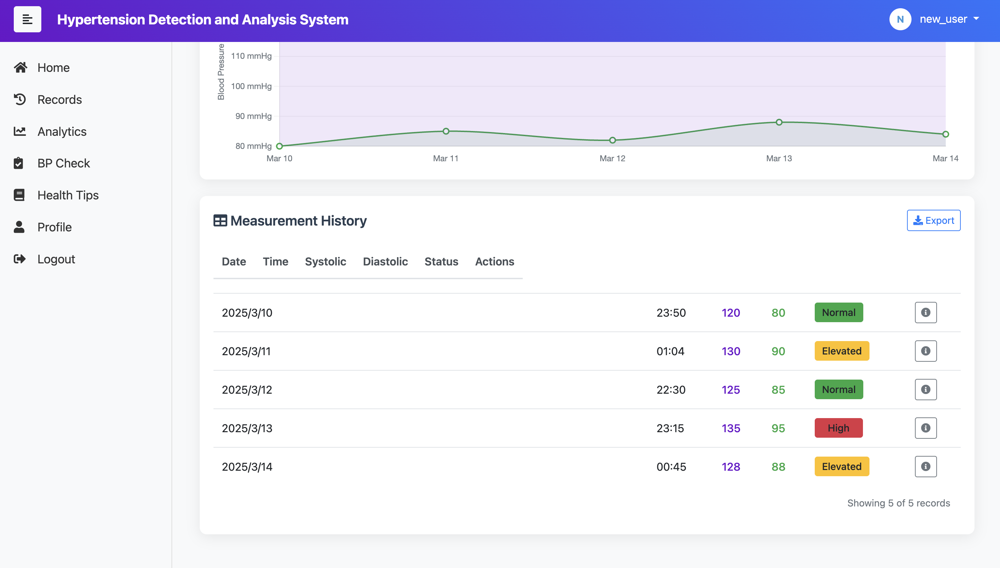
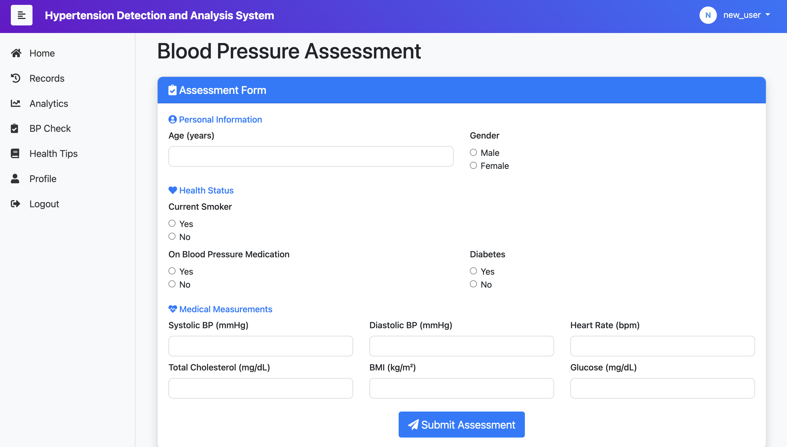
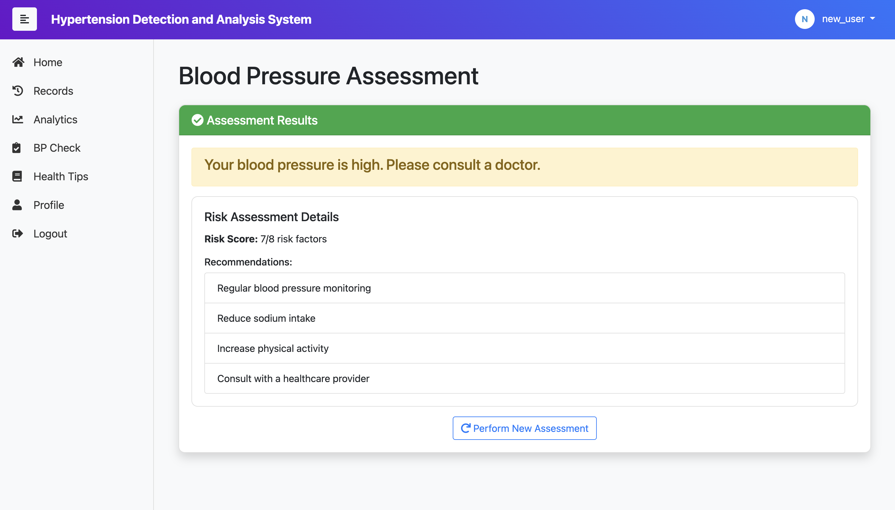

# Hypertension_Detection_Analysis_System

## 更新
- 2025-03-20: 
  - 搭建 `Flask` + `Bootstrap` 网页架构
  - 前端：Index + Records + Analysis
- 2025-03-23:
  - 前端：Login + Register
  - 后端：登陆注册逻辑实现
- 2025-03-24:
  - 新增 `Flask-Login` 管理用户会话
  - 新增 `werkzeug.security` 密码保护
  - 前端：Profile
  - 后端：修改个人信息逻辑
- 2025-03-28:
  - 修改个人信息编辑逻辑 $\to$ `db.Enum` 映射到数据库枚举字段
  - 新增 `flash` 错误信息显示
  - 前端：BP-Check
  - 后端：风险预测简单逻辑（待接入机器学习脚本）

## 功能
- 高血压记录于分析
- 基于机器学习的高血压风险预测
- 健康贴士+对话系统（待完善）
- 个人信息编辑

## 页面展示
- Index

- Register

- Login

- Profile

- Records

- Analysis

- BP Check (***ML***)

