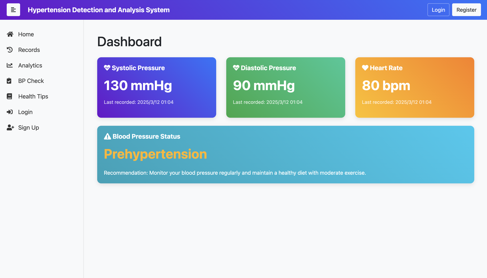

# Hypertension_Detection_Analysis_System

## 技术架构
- `Flask` + `Bootstrap`

## 功能
- 高血压记录于分析
- 基于机器学习的高血压风险预测
- 健康贴士+对话系统（待完善）
- 个人信息编辑

## 页面展示
- Index

- Register

- Login

- Profile

- Records

- Analysis

- BP Check (***ML***)

